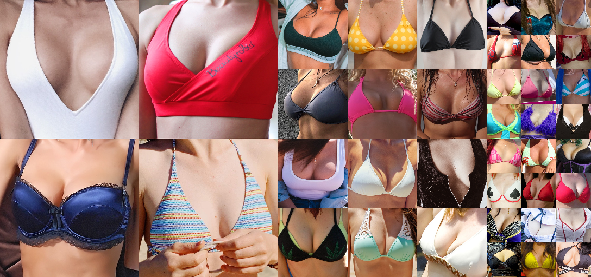
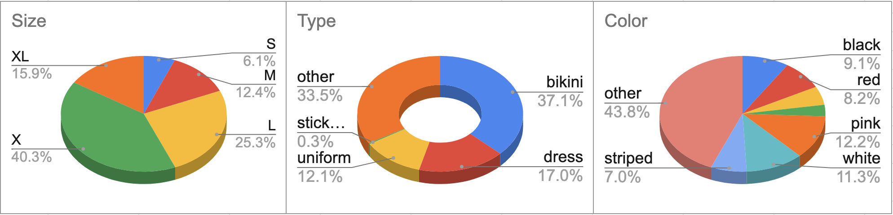

## Oppai-HQ Dataset (OPHQ)




Oppai-HQ (OppaiHQ) is a high-quality image dataset of human breasts, originally created for object-detection.

The dataset consists of 17K+, 73GB+ flickr image links, from 200x200 to 1024x1024+ resolution after crop bbox annotation.

The images were crawled from [Flickr](https://www.flickr.com/), all image has a voc format, data augmentation using download_oppai.py.

For pre-train ai-model inquiries, please contact [glenn](mailto:gg46power@gmail.com)

## Overview
the database db file is hosted on Git and can be download from Flickr with python.

High-level statistics:

Note: size classification accuracy is NOT enough, we need improve.

## Download script

You can either grab the data directly from Flickr or use the provided [download script](download_oppai.py). The script automatically downloading all the requested files, and output voc format xml, cropped bbox image.

```
> python download_oppai.py
Download Oppai-dataset Start ... using db: oppai.db

Total images count =  17884
Total size= 73.62 GB

[    1/17884] [Download] https://live.staticflickr.com/****************************.jpg 4.57 MB
[    2/17884] [Download] https://live.staticflickr.com/****************************.jpg 2.93 MB
[    3/17884] [Download] https://live.staticflickr.com/****************************.jpg 2.04 MB
....


> python download_oppai.py -h
usage: download_oppai.py [-h] [-c CROP] [-x XML] [-t TEST] [-d DB_FILENAME]

Download Oppai-HQ dataset to current working directory.

optional arguments:
  -h, --help            show this help message and exit
  -c CROP, --crop CROP  default=1, enable crop bbox image to crop directory
  -x XML, --xml XML     default=1, create voc xml file to xml directory
  -t TEST, --test TEST  test script, Skip Image Download
  -d DB, --db DB        database path, default=oppai.db

```

## SQLite Database

The `oppai.db` file contains the following information for each image in a machine-readable, sqlite3 format:

```
Table OppaiDB:
id | image_id | url | filename | size | width | height | t | l | w | h

image_id: image id or None
url: image download url
filename: image default file name
size: image size in bytes
width: image width
height: image height
t, l, w, h: Bounding Box Annotations, Top, Left, Width ,Height

```

## Licenses

The individual images were published in Flickr by their respective authors under

* All Rights Reserved
* [https://creativecommons.org/licenses/by/2.0/](https://creativecommons.org/licenses/by/2.0/)
* [https://creativecommons.org/licenses/by-nc/2.0/](https://creativecommons.org/licenses/by-nc/2.0/)
* [https://creativecommons.org/publicdomain/mark/1.0/](https://creativecommons.org/publicdomain/mark/1.0/)
* [https://creativecommons.org/publicdomain/zero/1.0/](https://creativecommons.org/publicdomain/zero/1.0/)
* [http://www.usa.gov/copyright.shtml](http://www.usa.gov/copyright.shtml)

The license and original author of each image are indicated in the metadata, can be output with download script.

The dataset itself (SQLite database, download script, and documentation, excpet image files) is made available under [Creative Commons BY-NC-SA 4.0](https://creativecommons.org/licenses/by-nc-sa/4.0/) license by Oppai-HQ Organization. You can **use, redistribute, and adapt sqlite database for non-commercial purposes**, as long as you (a) give appropriate credit by **citing our paper**, (b) **indicate any changes** that you've made, and (c) distribute any derivative works **under the same license**.

```
Waiting for Paper review...
```

* [https://creativecommons.org/licenses/by-nc-sa/4.0/](https://creativecommons.org/licenses/by-nc-sa/4.0/)

## Create BY Oppai-HQ Organization

* Glenn George (gg46power@gmail.com)
* William Collins
* Evan Kuo
* Kiyota Shukishi

## Privacy

To get your photo removed from the Oppai-HQ dataset:
Contact [glenn](mailto:gg46power@gmail.com). Please include your Flickr username or image links in the email.
We will check the photos from the user and update the dataset.
